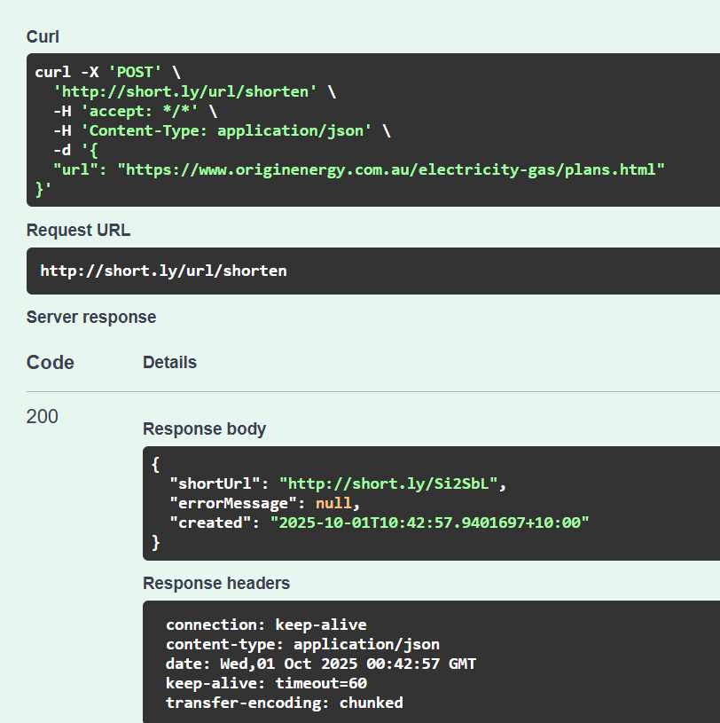
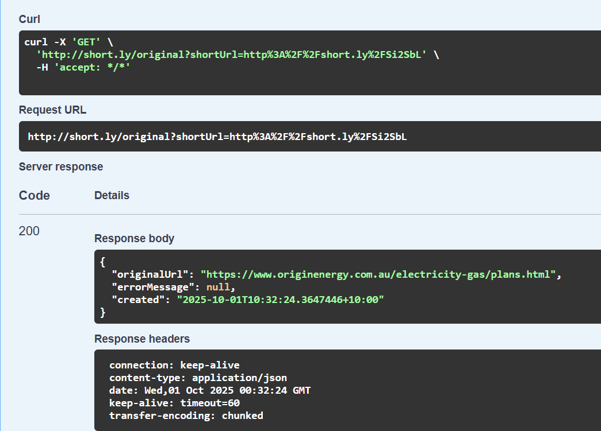
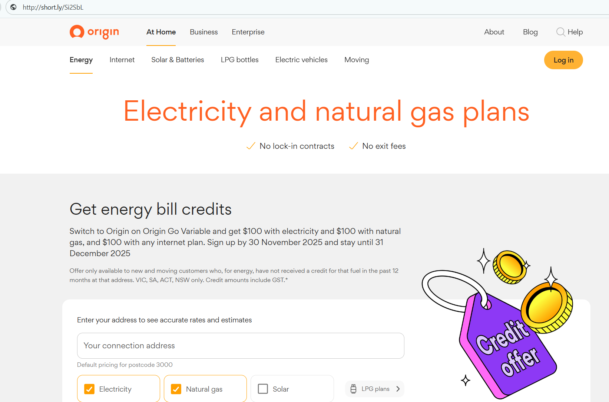

# Origin Energy URL Shortener API

To develop a simple URL Shortener API

Requirements:

API Endpoints:

○ Create ShortURL:

■ POST http://short.ly/url/shorten

Request body:json
{
"url": "string"
}

Response: HTTP 200 OK
Response body : json
{
"shortUrl": "string",
"errorMessage": {
"id": "3fa85f64-5717-4562-b3fc-2c963f66afa6",
"message": "string"
},
"created": "2025-09-30T11:40:51.953Z"
}


○ Retrieve Original URL:

■ GET http://short.ly/original
Query Param :: shortUrl = "string"

Response: HTTP 200 OK
Response body : json
{
"originalUrl": "string",
"errorMessage": {
"id": "3fa85f64-5717-4562-b3fc-2c963f66afa6",
"message": "string"
},
"created": "2025-09-30T11:42:14.743Z"
}

○ Redirect to Original URL from shortURL:

■ GET http://short.ly/{code}

Path Parameter :: code i.e alphanumeric code of shortened url

Response: Will be redirected to Original URL

## Authors

- [@poojashreedhar068](https://www.github.com/poojashreedhar068)


## PreRequisites

* Kotlin
* In-Memory Storage using json file
* Maven
* IntelliJ
* Docker if docker image needs to be generated

## Tech Stack

Framework : SpringBoot 3.*

Programming Language :  Kotlin

Log Framework : Logback with JSON Formatter

Monitoring tools : Actuator

OpenAPI : Swagger

Containerization : Docker


## Swagger Documentation

Swagger Documentation can be viewed on path :: http://short.ly/swaggerDoc 


## Used By

This project is used by the following:

- Pooja Shreedhar
- Origin Energy to access


## Deployment

```````To run on Intellij Or IDE OR Locally```````````
Step 1 :: Serve Localhost with custom domain
* For Window:
  To update the hosts file in Windows, you can follow these steps:

Press the Windows key
Type Notepad in the search field
In the search results, right-click Notepad and select Run as - administrator
Open the hosts file at C:\Windows\System32\Drivers\etc\hosts
Make the necessary changes to the file
Select File > Save to save your changes
127.0.0.1       short.ly

* For Mac:
Open terminal and run the command below

$ sudo nano /private/etc/hosts
And update the hosts file, replace the domain name with your domain.
Save the file and restart the machine.

Try to access the localhost app by your domain, in my case it will be short.ly

http://short.ly

* Run the main class UrlShortenerApplication.kt


## Running Tests

Manual Test:

Swagger URL can be used to manual testing

Unit Test:

Unit tests can be run by mvn install or mvn test commands

Performance Test:

Jmeter or any other performance testing tool can be used to perform testing.


## Screenshots 








